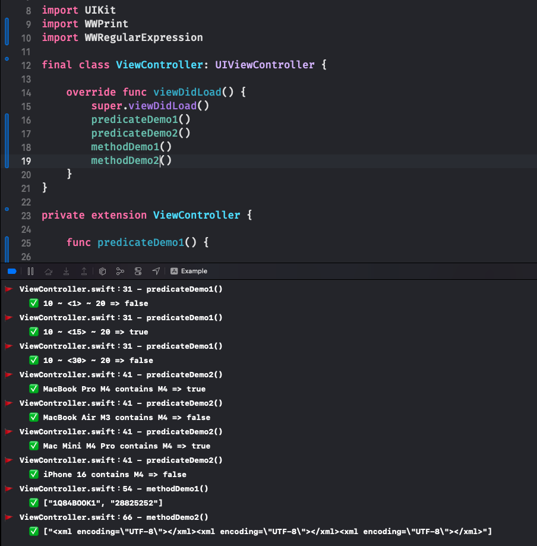

# WWRegularExpression
[](https://developer.apple.com/swift/) [](https://developer.apple.com/swift/)  [](https://developer.apple.com/swift/) [](https://developer.apple.com/swift/)

### [Introduction - 簡介](https://swiftpackageindex.com/William-Weng)
- [Wrap NSPredicate to make regular expressions easier to use on iOS.](https://atedev.wordpress.com/2007/11/23/正規表示式-regular-expression/)
- [包裝NSPredicate，讓正則表達式在iOS能更加容易使用。](http://darkk6.blogspot.com/2017/03/regexp-lookahead-lookbehind.html)



### [Installation with Swift Package Manager](https://medium.com/彼得潘的-swift-ios-app-開發問題解答集/使用-spm-安裝第三方套件-xcode-11-新功能-2c4ffcf85b4b)
```bash
dependencies: [
    .package(url: "https://github.com/William-Weng/WWRegularExpression.git", .upToNextMajor(from: "1.0.0"))
]
```

### Predicate - enum
|類型|功能|
|-|-|
|matches(regex:)|正則表達式 (正規式)|
|between(from:to:)|區間比對|
|contain(in:)|範圍比對|
|contains(with:)|中間包含文字|
|begin(with:)|開頭包含文字|
|end(with:)|結尾包含文字|
|outOfRange(from:to:)|範圍之外|

### Method - enum
|類型|功能|
|-|-|
|replace(text:pattern:template:)|字串取代|
|extracts(text:pattern:)|提取字串|

### Example
```swift
import UIKit
import WWPrint
import WWRegularExpression

final class ViewController: UIViewController {

    override func viewDidLoad() {
        super.viewDidLoad()
        predicateDemo1()
        predicateDemo2()
        methodDemo1()
        methodDemo2()
    }
}

private extension ViewController {
    
    func predicateDemo1() {
        
        let predicate = WWRegularExpression.Predicate.between(from: 10, to: 20).build()

        [1, 15, 30].forEach { number in
            let isInBetween = predicate.evaluate(with: number)
            wwPrint("10 ~ <\(number)> ~ 20 => \(isInBetween)")
        }
    }
    
    func predicateDemo2() {
        
        let predicate = WWRegularExpression.Predicate.contains(with: "M4").build()
        
        ["MacBook Pro M4", "MacBook Air M3", "Mac Mini M4 Pro", "iPhone 16"].forEach { string in
            let isContains = predicate.evaluate(with: string)
            wwPrint("\(string) contains M4 => \(isContains)")
        }
    }

    func methodDemo1() {
        
        let text = "<meta/><link/><title>1Q84BOOK1</title><title>28825252</title></head><body>"
        let pattern = "(?<=title>)([\\w\\d]{1,})(?=</title>)"
        let result = WWRegularExpression.Method.extracts(text: text, pattern: pattern).calculate()
        
        switch result {
        case .failure(let error): wwPrint(error)
        case .success(let numbers): wwPrint(numbers ?? [])
        }
    }
    
    func methodDemo2() {
        
        let text = "<xml encoding=\"Shift-JIS\"></xml><xml encoding=\"def\"></xml><xml encoding=\"ISO-8859-1\"></xml>"
        let pattern = "(encoding=\")[^\"]+(\")"
        let result = WWRegularExpression.Method.replace(text: text, pattern: pattern, template: "UTF-8").calculate()
        
        switch result {
        case .failure(let error): wwPrint(error)
        case .success(let numbers): wwPrint(numbers ?? [])
        }
    }
}
```
